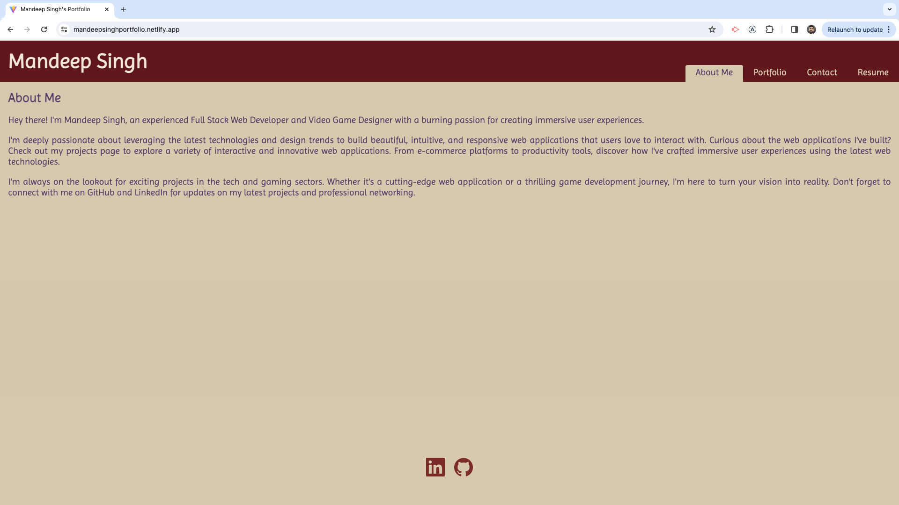

# React Portfolio Website

## Description
A portfolio page built using React to demonstrate my work creating websites, databases, APIs, and node.js applications.

## Table of Contents

- [Installation](#installation)
- [Usage](#usage)
- [License](#license)
- [Questions](#questions)

## Installation

[Deployed Website](https://mandeepsinghportfolio.netlify.app/)

## Usage

- **About Section:** Click on "About" to view a recent photo of the developer and a short bio.

- **Portfolio Section:** Click on "Portfolio" to see titled images of the developer’s applications. Each project card links to a detailed project description, including deployed applications, GitHub repositories, and demonstration videos (when available).

- **Contact Section:** Click on "Contact" to access a contact form with fields for a name, an email address, and a message.

- **Resume Section:** Click on "Resume" to view a link to download the developer's resume and a list of proficiencies.

## License

This application is covered under the MIT License.

## Questions

[GitHub Profile](https://github.com/mandeepiscoding)

Please contact mandeeps0518@gmail.com for any questions.